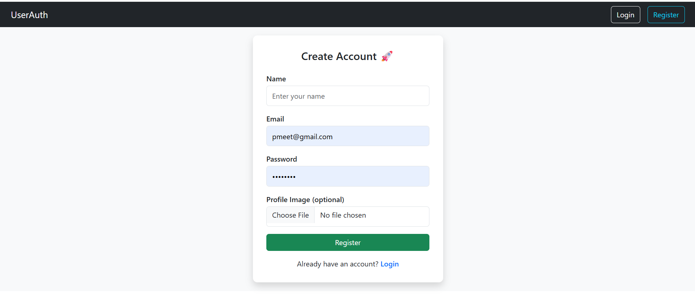
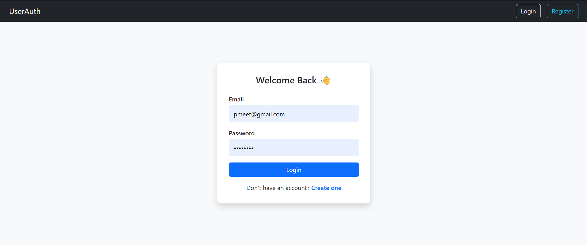
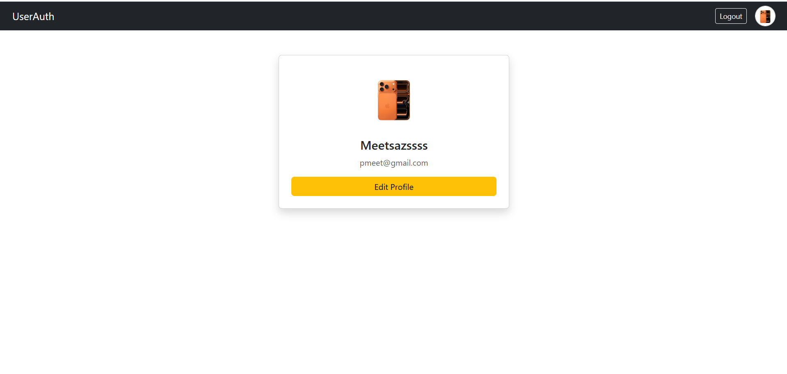

<!-- # React + Vite

This template provides a minimal setup to get React working in Vite with HMR and some ESLint rules.

Currently, two official plugins are available:

- [@vitejs/plugin-react](https://github.com/vitejs/vite-plugin-react/blob/main/packages/plugin-react) uses [Babel](https://babeljs.io/) (or [oxc](https://oxc.rs) when used in [rolldown-vite](https://vite.dev/guide/rolldown)) for Fast Refresh
- [@vitejs/plugin-react-swc](https://github.com/vitejs/vite-plugin-react/blob/main/packages/plugin-react-swc) uses [SWC](https://swc.rs/) for Fast Refresh

## React Compiler

The React Compiler is not enabled on this template because of its impact on dev & build performances. To add it, see [this documentation](https://react.dev/learn/react-compiler/installation).

## Expanding the ESLint configuration

If you are developing a production application, we recommend using TypeScript with type-aware lint rules enabled. Check out the [TS template](https://github.com/vitejs/vite/tree/main/packages/create-vite/template-react-ts) for information on how to integrate TypeScript and [`typescript-eslint`](https://typescript-eslint.io) in your project. -->

UserAuth – MERN Authentication System

AccountApp is a full-stack MERN application that provides secure user authentication and profile management. Users can register, log in, update their profile information, and manage a profile image.

🚀 Features

User registration & login

JWT authentication using HTTP-only cookies

Auto login on page refresh

Protected routes

Profile management (edit name, email, avatar)

Profile image upload, preview & remove

Default avatar support

Responsive UI using Bootstrap

🛠️ Tech Stack

Frontend: React, Redux Toolkit, React Router, Axios, Bootstrap
Backend: Node.js, Express.js, MongoDB, Mongoose, JWT, bcrypt, Multer, Cloudinary

📂 Project Structure

backend/   → Express API, MongoDB, Auth & Cloudinary
client/    → React UI with Redux & protected routes

⚙️ Setup (Quick)

# Backend
cd backend
npm install
npm run dev

# Frontend
cd client
npm install
npm run dev

  